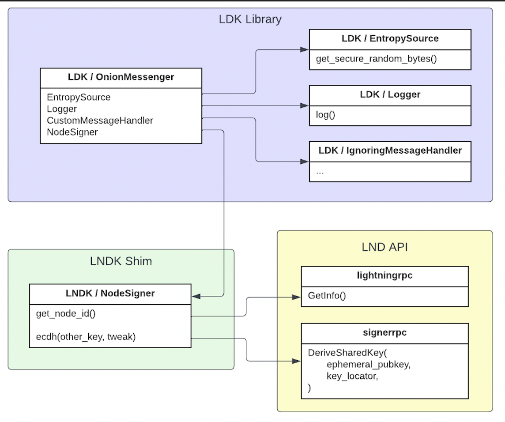
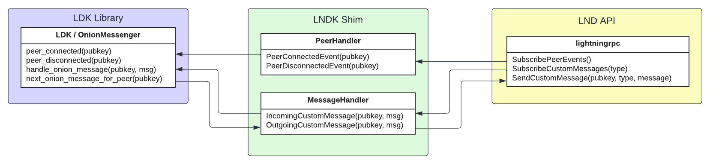

# LNDK

An experimental attempt at using [LDK](https://github.com/lightningdevkit/rust-lightning) to implement [bolt 12](https://github.com/lightning/bolts/pull/798) features for [LND](https://github.com/lightningnetwork/lnd). 
* [Contributor guidelines](https://github.com/carlaKC/lndk/blob/master/CONTRIBUTING.md)
* [Code of Conduct](https://github.com/carlaKC/lndk/blob/master/code_of_conduct.md)

## Setting up LNDK

To run `LNDK`, `LND` is assumed to be running. For directions on how to do this, try [this guide](https://docs.lightning.engineering/lightning-network-tools/lnd/run-lnd).

When compiling `LND`, make sure that the peersrpc and signerrpc services are enabled, like this:

`make install --tags="peersrpc signerrpc"`

In order to successfully connect to `LND`, we need to pass in the grpc address and authentication credentials. These values can be passed in via the command line when running the `LNDK` program, like this:

`cargo run -- <ADDRESS> <TLSPATH> <MACAROONPATH>`

Or in a more concrete example:

`cargo run -- https://localhost:10009 /home/<USERNAME>/.lnd/tls.cert /home/<USERNAME>/.lnd/data/chain/bitcoin/regtest/admin.macaroon`

**Remember** that the grpc address must start with https:// for the program to work.

## Architecture
There are three components relevant to our architecture:

1. [LDK](https://github.com/lightningdevkit/rust-lightning): imported as a dependency to provide onion message processing and forwarding capabilities.
2. [LND](https://github.com/lightningnetwork/lnd): the grpc API that is exposed by the target LND node built with the appropriate rpc subservers.
3. [LNDK](https://github.com/carlaKC/lndk): a thin rust shim that connects to LND's API (via grpc), acting as a shim that connects LND's APIs to LDK's functionality and providing input/output to the LND node.

The use of LND's flexible API and LDK's modular lightning library allows us to re-use the bolt 12 implementation in LDK. LNDK itself is intended to act as a simple shim that facilitates communication between LND and the LDK library - wrapping API calls in trait implementations for LDK, converting types and passing messages between the LDK state machine and LND's APIs.

So, basically, Frankeinstein's monster. With extra steps.

### Onion Messages
Onion messaging is implemented using by implementing a custom version of LDK's [OnionMessenger](https://github.com/lightningdevkit/rust-lightning/blob/435b3b480283e40f7b8a945eff6465438f39cd5b/lightning/src/onion_message/messenger.rs#L106) that can use LND's node key to process onion messages. This is achieved by implementing the [NodeSigner](https://github.com/lightningdevkit/rust-lightning/blob/fac5373687a4c7919c8639744dc712d922082cc3/lightning/src/chain/keysinterface.rs#L452) trait, making relevant calls to LND's `signerrpc` API to perform ECDH ops with the node's private key. All other components can use the built-in options available in LDK.

Once we have an `OnionMessenger` that can process messages on behalf of the LND node, we need to handle events that are relevant to the messenger. 
1. [SubscribePeerEvents](https://lightning.engineering/api-docs/api/lnd/lightning/subscribe-peer-events#grpc): subscribe to peer events and notify the `OnionMessenger` of `peer_connected` and `peer_disconnected` events.
2. [SubscribeCustomMessages](https://lightning.engineering/api-docs/api/lnd/lightning/subscribe-custom-messages#grpc): receive incoming onion messages from LND and deliver them to the `OnionMessenger` via `handle_onion_message`
3. [SendCustomMessage](https://lightning.engineering/api-docs/api/lnd/lightning/send-custom-message#grpc): poll the `OnionMessenger` for `next_onion_message_for_peer` and deliver queued outbound onion messages to LND for sending. 

